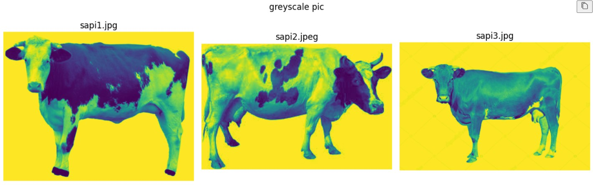
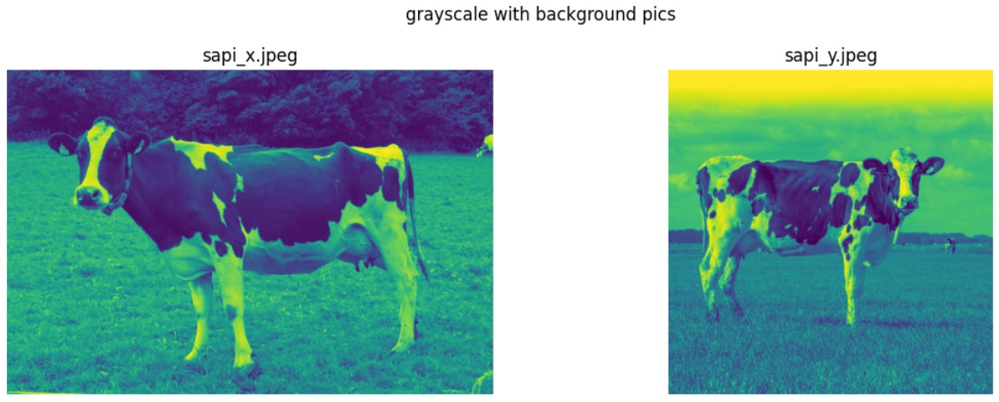
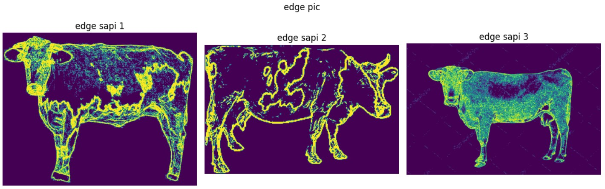
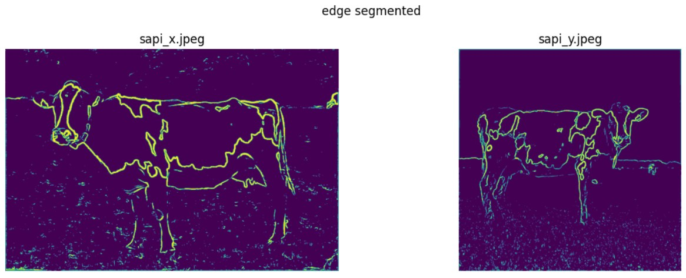

# sapixy

## Overview
This project focuses on the implementation of numerical methods in Python for image processing and computer vision tasks. The project serves as the final project for a numerical methods course at my university. The main goal of the project is to explore and apply various numerical techniques to solve problems in image processing and computer vision domains. The project is divided into three main parts: image gradients, edge detection, and image blurring. The project is implemented from scratch using Python and not using any library aside from OpenCV for reading image and matplotlib for showing output.

### Key Techniques Used:

1. Approximation with Finite Difference:

- Implementation of finite difference methods for approximating derivatives in image gradients.
- Use of central difference kernels for calculating the gradient in the x and y directions.
- Approximation of the magnitude of the gradient using the square root of the sum of squared gradients.

2. Double Thresholding:

- Utilization of double thresholding technique for edge detection.
- Setting different intensity values for pixels based on their magnitude.
- Categorizing pixels into strong, weak, and non-edge points using high and low threshold values.

3. Non-linear Interpolation:

- Application of non-linear interpolation to connect edge segments in image processing.
- Interpolation of edge points between start and end points using weighted intensity values.
- Adjusting interpolated intensities based on neighboring pixel intensities and interpolation weights.

4. Convolution:

- Implementation of convolution operation for image blurring using a 1D Gaussian kernel.
- Creation of a 1D Gaussian kernel based on the desired blur strength.
- Application of horizontal and vertical passes using nested loops for efficient separable blurring.

## Sample Inputs:
  

## Sample Outputs:
  

## How to Run:
1. Clone the project using the following command:
```
git clone
```

2. Run the project using google colab or jupyter notebook.

# Credits
1. Rachel Naragifta
2. Kadek Ninda Nandita Putri
3. Gelora Damayanti Manalu

## Reference
- Course notes
- Previous assignment
- https://www.analyticsvidhya.com/blog/2018/06/understanding-building-object-detection-model-python/
- https://programmathically.com/foundations-of-deep-learning-for-object-detection-from-sliding-windows-to-anchor-boxes/
- https://towardsdatascience.com/image-derivative-8a07a4118550
